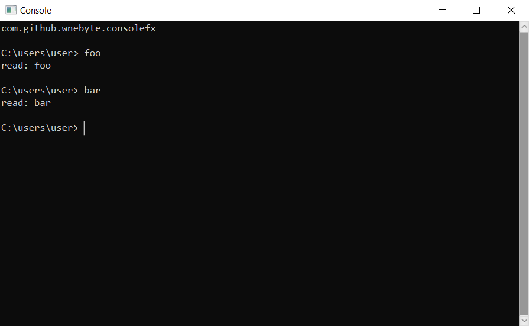

# fx-console

A javafx library that can be used to build a "pretty console".

## Table of Contents

- [About](#about)
- [Sample](#sample)
- [Images](#images)

## About

This javafx project contains a css-styleable <code>Console</code> class.
Both the console itself, and any appended text can be styled using css.

## Sample

### 1: Setup

This sample demonstrates how to create and initialize a console that has no styles applied, 
no prefix, and which simply echoes any input given to it.

    class Sample extends Application {
        public void start(Stage stage) {
            Console console = new Console();
            console.setCallback(s -> {
                console.println("read: " + s + "\n");
            });
            stage.setScene(new Scene(console, 895, 515));
            stage.show();
        }
    }
    
### 2: Prefix

This sample demonstrates how to apply a stylesheet to a console and how to set the console's optional prefix property. 

    ...
    String path = getClass().getResource("stylesheet.css").toExternalForm();
    console.getStylesheets().add(path);
    StyleText prefix = new StyleTextBuilder()
            .append("wne@MSI", "green")
            .whitespace()
            .append("MINGW64", "purple")
            .whitespace()
            .append("~", "green")
            .ln()
            .append("$", "text")
            .build()
    console.setPrefix(prefix);

Each individual <code>StyleTextSegment</code> consists of some text and a Collection of style classes 
to be applied to said text.  
Each style class that is referenced from a StyleTextSegment has to be defined in an external stylesheet.

    ...
    console.ready();

Unlocks (if currently locked) the Console and appends its optional prefix.
 
## Images

### /css/gitbash.css

### /css/win.css

